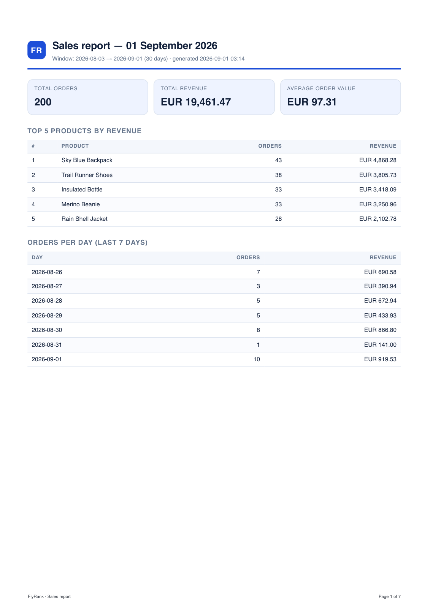
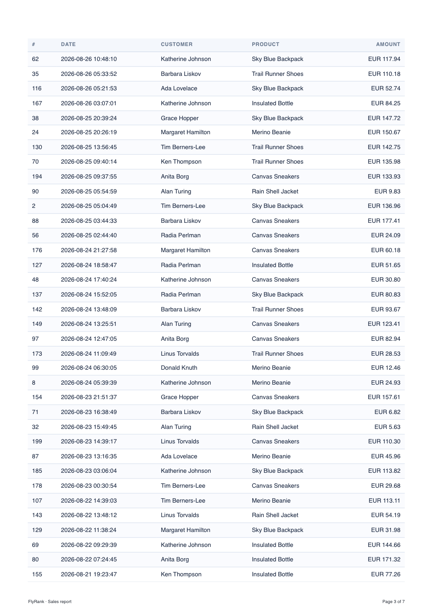

# PDF report generator

*FlyRank Internship · Backend Track · W4 · A8 — Python lane (FastAPI + SQLite + Playwright).*

A small API that does the classic SaaS feature end to end: **query → render → store → serve.**
One SQL pass turns 200 orders into five numbers, an HTML template turns those numbers into a
page, headless Chromium prints the page to a real PDF, and the API hands out the file **by link**
— the JSON responses only ever carry the file's address.



---

## Dataset

**Option A — the little shop.** `scripts/seed.py` fills `report.db` with ~200 random orders
(`customer`, `product`, `amount`, `created_at`) spread over the last 30 days, drawn from six
products. Running the seed twice leaves exactly 200 rows: the script clears the table first.

## Run it

```bash
# 1 · install (Python 3.10+)
python -m venv .venv && source .venv/bin/activate
pip install -r requirements.txt
playwright install chromium          # ~1 min, downloads the browser Playwright drives

# 2 · seed the database
python -m scripts.seed               # -> SELECT COUNT(*) FROM orders -> 200
python -m scripts.seed               # run it twice: still 200

# 3 · start the API
uvicorn app.main:app --reload --port 8000
```

Interactive docs: <http://127.0.0.1:8000/docs>.

Two extra entry points, useful on their own:

```bash
python -m scripts.print_report            # Stage 2 — the report object as JSON
python -m scripts.render_pdf              # Stage 3 — writes reports/test.pdf directly
```

Tests:

```bash
pytest            # 14 fast tests, no browser
pytest -m slow    # renders a real PDF and asserts ≥2 pages + a repeating table header
```

> **macOS 12 note:** `requirements.txt` pins `playwright==1.47.0`, the last release that ships a
> Chromium build for macOS 12. Newer Playwright is fine on newer systems. If your platform has no
> Chromium download at all, set `BROWSER_CHANNEL=chrome` to drive an installed Google Chrome
> instead.

## API

| Method | Path                 | What it does                                                          |
| ------ | -------------------- | --------------------------------------------------------------------- |
| GET    | `/health`            | `{"status":"ok"}`                                                      |
| POST   | `/reports`           | Runs the pipeline. **201** + `{id, file}` for a new report, **200** for today's existing one. Body (optional): `{"days": 7, "force": false}` |
| GET    | `/reports`           | Lists generated reports with their links                               |
| GET    | `/reports/{id}`      | The record for one report · unknown id → **404**                       |
| GET    | `/reports/{id}/file` | Streams the PDF from disk (`FileResponse`) · missing → **404**         |

## The aggregation SQL

All four queries live in [`app/queries.py`](app/queries.py), one named constant each.
`:since` is `today - (days - 1)`; the per-day section uses a 7-day window.

```sql
-- Two totals (plus average order value)
SELECT COUNT(*)                 AS total_orders,
       COALESCE(SUM(amount), 0) AS total_revenue,
       COALESCE(AVG(amount), 0) AS average_order_value
FROM orders
WHERE date(created_at) >= :since;

-- Top 5 products by revenue
SELECT product,
       COUNT(*)    AS orders,
       SUM(amount) AS revenue
FROM orders
WHERE date(created_at) >= :since
GROUP BY product
ORDER BY revenue DESC
LIMIT 5;

-- Orders per day, last 7 days (quiet days are zero-filled in Python)
SELECT date(created_at) AS day,
       COUNT(*)         AS orders,
       SUM(amount)      AS revenue
FROM orders
WHERE date(created_at) >= :since
GROUP BY day
ORDER BY day;

-- The long table at the bottom of the PDF
SELECT id, customer, product, amount, created_at
FROM orders
WHERE date(created_at) >= :since
ORDER BY created_at DESC, id DESC;
```

## Proof: POST → download

```console
$ curl -s -w '\n-> %{http_code} in %{time_total}s\n' -X POST http://127.0.0.1:8000/reports
{"id":1,"file":"/reports/1/file","filename":"sales-report-2026-09-01-1.pdf",
 "created_at":"2026-09-01 03:12:45","report_date":"2026-09-01","days":30,"reused":false}
-> 201 in 0.514s

$ curl -s -o my-report.pdf -D - http://127.0.0.1:8000/reports/1/file | head -5
HTTP/1.1 200 OK
content-type: application/pdf
content-disposition: attachment; filename="sales-report-2026-09-01-1.pdf"

$ file my-report.pdf
my-report.pdf: PDF document, version 1.4, 7 pages

$ curl -s -o /dev/null -w '%{http_code}\n' http://127.0.0.1:8000/reports/999
404
```

### The double-click proof (Stage 5)

```console
$ curl -s -o /dev/null -w 'POST -> %{http_code}\n' -X POST http://127.0.0.1:8000/reports
POST -> 201        # {"id":1, ..., "reused":false}
$ curl -s -o /dev/null -w 'POST -> %{http_code}\n' -X POST http://127.0.0.1:8000/reports
POST -> 200        # {"id":1, ..., "reused":true}   ← same id

$ ls reports/
sales-report-2026-09-01-1.pdf        # exactly one new file

$ curl -s -X POST -H 'content-type: application/json' -d '{"force":true}' \
       http://127.0.0.1:8000/reports
{"id":2,"file":"/reports/2/file", ...,"reused":false}   # force → a new id
```

### Page breaks survived

Page 3 of the same PDF — the ledger continues, the header row is repeated, and no row is sliced:



## Stage 4 — at what point would I move this work out of the request?

**As soon as the work stops being reliably sub-second — in practice, the moment reports are
generated for anyone but the single user who clicked the button.** A request that runs for
seconds holds a worker, a socket and the user hostage, and any timeout, retry or refresh in
between turns into wasted work or a duplicate; at that point generation belongs in a background
job that returns `202 Accepted` + an id immediately, with `GET /reports/{id}` reporting
`pending`/`done`. (Numbers below: 200 orders → 0.5 s, 5,000 orders → 5.2 s.)

## Stage 5 — what the duplicate check protects against

**What it protects against:** a double-clicked "Generate report" button (or a retry, or a refresh)
producing two identical PDFs — two runs of the expensive pipeline, two files on disk, two rows in
the database, and two different links to the same truth. `POST /reports` therefore looks for
today's report with the same parameters first and returns it with **200** instead of generating a
second one; only `{"force": true}` skips the check.

**Where a missing check costs money:** the classic one is the "your report is ready" email — a
retried webhook that emails every customer twice is an apology, a support queue and a bill from
the mail provider. The same shape ruins payments: a re-submitted checkout that charges the card
twice is the same missing idempotency key, only with a chargeback attached.

## Design notes

- **Store and link.** Only `GET /reports/{id}/file` moves megabytes; every other response is a few
  bytes of JSON carrying an address. The PDF lives on disk, its path lives in the `reports` table.
- **The daily slot is enforced by the database**, not just by the check: a partial unique index on
  `(report_date, params_key) WHERE superseded_at IS NULL` means even two racing requests cannot
  create two current reports for the same day. An in-process `asyncio.Lock` serialises generation
  on top of that.
- **`force` retires, it does not delete.** The replaced report keeps its row and its file, so a
  link already handed out never 404s. Ids are `AUTOINCREMENT`, so they are never recycled.
- **The row is claimed before the slow work starts** and removed again if rendering fails, so a
  crashed render never occupies the day's slot or leaves a dangling record.
- **One browser, not one per request.** Chromium is launched once in the FastAPI lifespan and
  reused; launching it per report would add ~1 s to every call.
- **Print CSS does the page-break work**: `tr { break-inside: avoid }`, the header row in
  `<thead>` (`display: table-header-group`) so it repeats, `break-after: avoid` on headings, and
  the long ledger starts on a fresh page. Page numbers come from Playwright's footer template,
  because Chromium ignores CSS paged-media margin boxes.

## Extras built

- **Parameterized report** — `POST /reports {"days": 7}`; the window is part of the idempotency
  key, so a 7-day and a 30-day report can both exist on the same day.
- **A control panel** — `GET /reports` lists every generated report with its link.
- **Nice filenames** — `sales-report-2026-09-01-1.pdf`, used for the `Content-Disposition` too.
- **Make it pretty** — logo, brand colours, stat cards, zebra-striped tables, and a repeating
  footer with `Page N of M`.
- **The big-table experiment** — reseeded with 5,000 orders (`python -m scripts.seed --orders
  5000`), the same endpoint answered in **5.16 s** with a **140-page** PDF, against **0.5 s** for
  200 orders. Rendering cost grows with the size of the document, not with the size of the
  request: ten times the rows made the endpoint ten times slower while the user stared at a
  spinner. That is the line where the work has to leave the request and become a background job.

## Layout

```
app/
  main.py           FastAPI app + lifespan (one SQLite connection, one browser)
  config.py         settings, overridable by env (DB_PATH, REPORTS_DIR, BROWSER_CHANNEL)
  db.py             connection helpers + schema (orders, reports)
  queries.py        Stage 2 — every aggregation query, named
  rendering.py      Stage 3 — Jinja template → HTML → page.pdf()
  service.py        Stages 4 & 5 — the pipeline and the once-per-day rule
  schemas.py        request/response models
  dependencies.py   app-scoped resources
  routers/          health.py, reports.py
  templates/        report.html.j2 (the print CSS lives here)
scripts/
  seed.py           Stage 1 — safe to run twice
  print_report.py   Stage 2 checkpoint — the report object as JSON
  render_pdf.py     Stage 3 checkpoint — reports/test.pdf
tests/              14 fast tests + 1 slow one that renders a real PDF
```

`reports/` and `report.db` are gitignored — generated artifacts and databases are not source.
The seed script is their recipe.

## Not done

Stage 7 ("the AI rematch") is deliberately left out: it asks for a prompt written from memory by
the person who built Stages 0–6 by hand, and for their own comparison of the two. That is the
author's exercise, not the code's.
